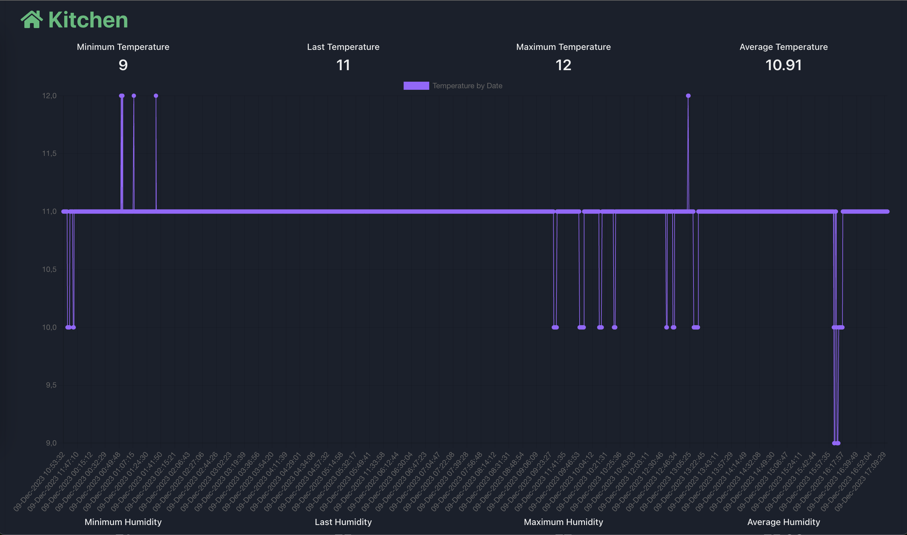
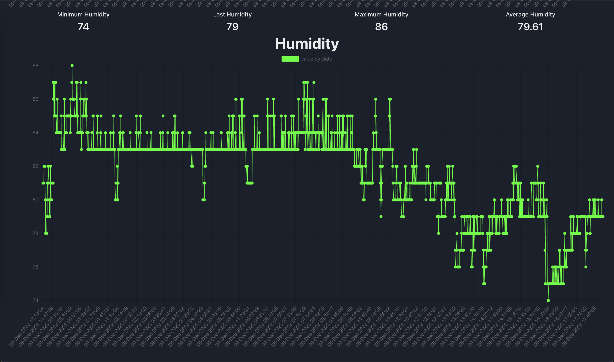
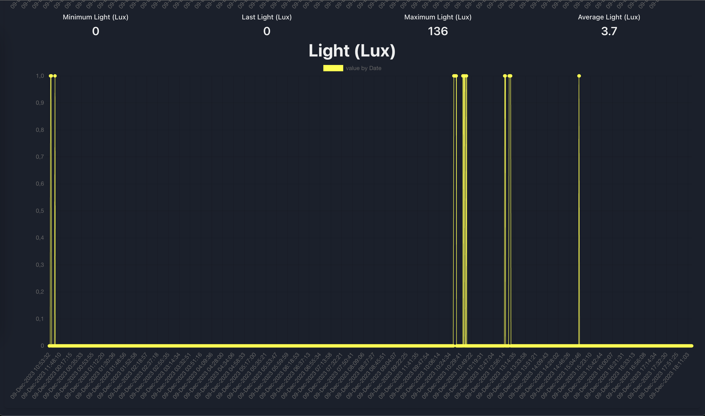

# Elisys Home Automation Server (Java)

**Elisys Home Automation Server (Java)** is the back-end side
for the following projects:

- [**Elisys ESP32 Motion Detector (Rust)**](https://github.com/goto-eof/esp32-motion-detector-and-server-notifier-rust)
- [**Elisys ESP32 Weather Station (Rust)**](https://github.com/goto-eof/elisys-esp32-weather-station-client-rust)
- [**Elisys ESP32 Relay Client (Rust)**](https://github.com/goto-eof/elisys-esp32-relay-client-rust)
- [**Elisys ESP32 Alarm Clock (Rust)**](https://github.com/goto-eof/elisys-esp32-alarm-clock-rust)

There is also a basic implementation of the front end side, and it is called 
- [**Elisys Home Automation Client (TypeScript)**](https://github.com/goto-eof/elisys-home-automation-client-typescript)

Currently, Elisys Home Automation Server supports the motion, temperature, humidity and pressure sensors, so that it
allows to
store and retrieve the data provided by a several sensors controlled by a ESP32 device (or Raspberry Pi).
Moreover, E.H.A.S. provides the functionality to control remotely a Relay device and to control an Alarm Clock (WIP).

In brief E.H.A.S. allows to:

- retrieve data from a Motion detector
    - supply the configuration for the motion sensor when it starts for the first time;
    - send notifications via Discord when a motion is detected, so that when a post request is handled;
    - keep trace about the sensor status:  alive/disabled.

- retrieve data from a Weather station
    - store temperature/humidity/pressure from sensors
    - provide the last temperature/humidity/pressure values
    - provide the list of temperature/humidity/pressure values by date
    - provide the average of temperature/humidity/pressure by date
    - provide the minimum temperature by date
    - provide the maximum temperature by date

- control remotely a Relay
    - control remotely a Relay

- control remotely an Alarm Clock (WIP)
    - enable/disable alarms

# Technologies

Elisys Home Automation was implemented using Java, Spring Boot, MapStruct, Lombok, OpenApi, Feign, Liquibase, Hibernate
and
PostgreSQL.

# Before you run the application

Rename `src/main/resources/application.properties` in `src/main/resources/application-dev.properties`.

Configure IntelliJ IDEA in this way:


Before run the application for the first time it is necessary to configure these properties in `application.properties`
file in order to make motion sensor work properly:

```
feign.discord.message.post=/api/webhooks/846237846238746328746/HELLO_WORLD

app.configuration.default.motion.sensor.iamalive.interval.seconds=30
app.configuration.default.motion.sensor.iamalive.endpoint=http://localhost:8080/api/v1/i-am-alive/notify
app.configuration.default.motion.sensor.alert.endpoint=http://localhost:8080/api/v1/motion-sensor/alert
```

# How to run it?

Just build the jar by executing the following statement:

```
./gradlew bootJar 
```

Next, run an instance of PostgreSQL:

```
sudo docker-compose up -d
```

Then run the jar `elisys-home-automation.jar` located in `build/libs` in the following way:

```
java -jar elisys-home-automation.jar
```

Or for external configuration file:

```
java -jar -Dspring.config.location=application-dev.properties elisys-home-automation.jar
```

# OpenApi

The API documentation can be found at the following URI (after server starts):

[http://localhost:8080/swagger-ui/index.html](http://localhost:8080/swagger-ui/index.html)

# Pictures
### Front-end | Weather Station | Temperature

### Front-end | Weather Station | Humidity

### Front-end | Weather Station | Light (Lux)


# Note

There is a postman collection in the root project directory that can be imported in your postman environment.

This project is a Work In Progress.

If you found a bug please contact me [here](https://andre-i.eu/#contactme).
