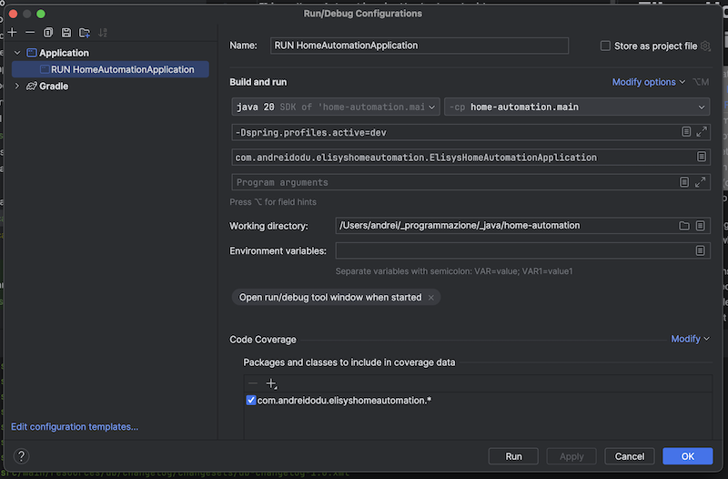

# Elisys Home Automation Server (Java)

Elisys Home Automation is the back-end side
for [**ESP32 IDF | Motion Detector and Server Notifier (Rust)**](https://github.com/goto-eof/esp32-motion-detector-and-server-notifier-rust)
project. Currently, Elisys Home Automation supports only the motion sensor device, so that it allows to retrieve the
data provided by a motion sensor controlled by a ESP32 device (or Raspberry Pi). In particular, it allows to:

- supply the configuration for the motion sensor when it starts for the first time;
- send notifications via Discord when a motion is detected, so that when a post request is handled;
- take trace about the sensor status:  alive/disabled.

# Technologies

Elisys Home Automation was implemented using Java, Spring Boot, MapStruct, Lombok, OpenApi, Feign, Liquibase, Hibernate
and
PostgreSQL.

# Before you run the application

Rename `src/main/resources/application.properties` in `src/main/resources/application-dev.properties`.

Configure IntelliJ IDEA in this way:



Before run the application for the first time it is necessary to configure these properties in `application.properties`
file:

```
feign.discord.message.post=/api/webhooks/846237846238746328746/HELLO_WORLD

app.configuration.default.motion.sensor.iamalive.interval.seconds=30
app.configuration.default.motion.sensor.iamalive.endpoint=http://localhost:8080/api/v1/i-am-alive/notify
app.configuration.default.motion.sensor.alert.endpoint=http://localhost:8080/api/v1/motion-sensor/alert
```

# How to run it?

Just build the jar by executing the following statement:

```
./gradlew bootJar 
```

Next, run an instance of PostgreSQL:

```
sudo docker-compose up -d
```

Then run the jar `elisys-home-automation.jar` located in `build/libs` in the following way:

```
java -jar elisys-home-automation.jar
```

# OpenApi

The API documentation can be found at the following URI (after server starts):


[http://localhost:8080/swagger-ui/index.html](http://localhost:8080/swagger-ui/index.html)


This project is a Work In Progress.

If you found a bug please contact me [here](https://andre-i.eu/#contactme).
